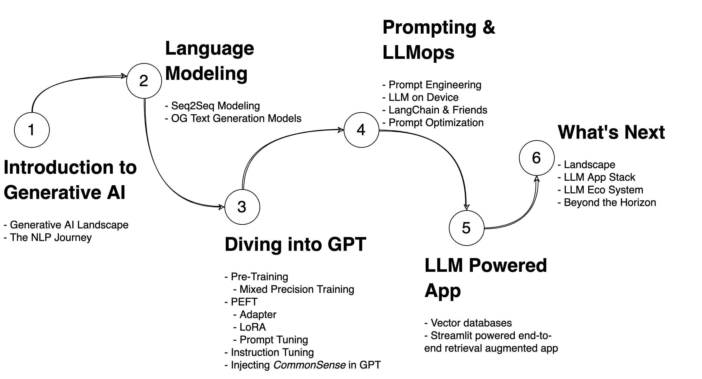

# Workshop: Natural Language Processing using Generative Models
> LLM Workshop at Data Hack Summit, August 2023
>> [Raghav Bali](https://www.linkedin.com/in/baliraghav/) and [Amar Lalwani](https://www.linkedin.com/in/amar-lalwani-aa69b875/)
---
## Prerequisites
- Basics/hands-on experience of working with python
- Basic understanding of linear algebra and machine larning
- Basics of NLP is a plus (not required though)
- Basic understanding of Deep Neural Networks
- Basics/hands-on experience with pytorch
- Access to google-colab or similar python environment
- Access to chatGPT or Google-Bard (free access)

## Agenda

---

**Module 1: Introduction to Generative AI**
+ Introduction to Generative AI
+ The NLP Journey (TF-IDF to Word2Vec to Sequence Modeling to Transformers)
  
**Module 2: LM Fundamentals**
+ Language Modeling using Seq2Seq Models
+ LM Fundamentals
+ The Text Generation using OG Language Models 
 
**Module 3: Diving into GPT**
+ Pre-Training
   + Mixed Precision Training
+ PEFT
   + Adapter
   + LoRA
   + Prompt Tuning
+ Instruction Tuning
+ Injecting CommonSense in GPT

**Module 4: LLM-Ops & Prompting**
+ Setting up an LLM on-prem
+ Prompt Engineering 
+ Prompt Optimization

**Module 5: Building Your Own LLM Powered App**
+ End to End Setup

**Module 6: Next Frontier**
+ New AI Tools (chatGPT Plugins, BARD, PALM APIs)
+ What Next? (AutoGPT, GPT-4 and beyond)

